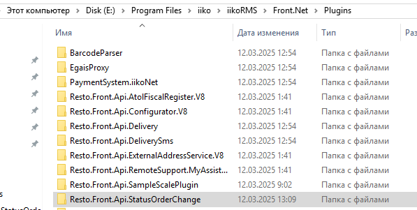
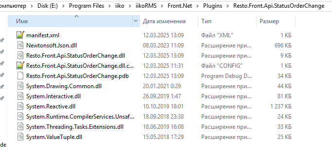
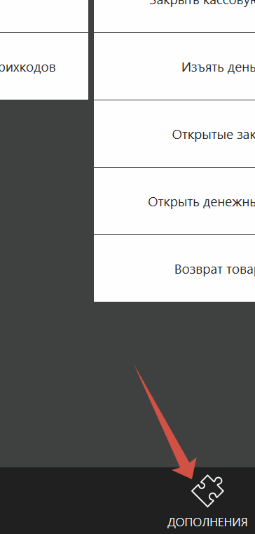
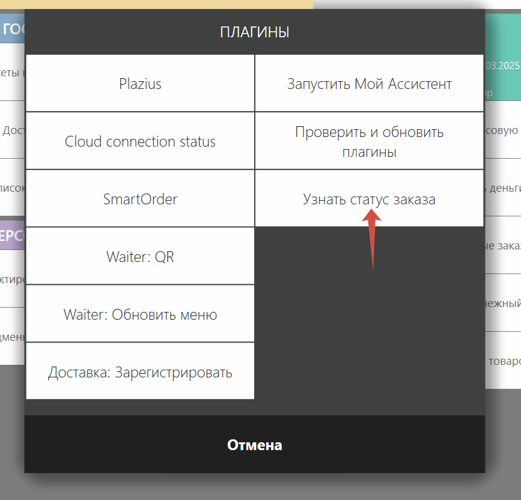
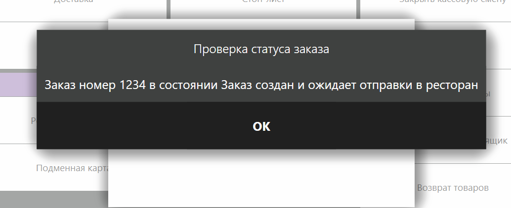

# iiko.plugin

Плагин для получения данных по статусу заказа

После скачивания нужно скомпилировать файлы проекта,после чего можно их увидеть в папке debug

  

Для установки серверка можно использовать эту инструкцию
https://ru.iiko.help/articles/#!api-documentations/instruktsiya-po-ustanovke-demo-servera

После установки у нас должны появится в которых хранятся уже используемые плагины и туда мы можем добавить свой,само размещение плагинов происходит по пути С:\Program Files\iiko\iikoRMS\Front.Net\Plugins, там создаем папку с названием нашего плагина

  

И переходим в нее,туда переносим файлы которые получили после компилирования плагина

  

Потом перезапускае iikoFront и на главном меню нажимаем кнопку Дополнения 

  

После чего откроется модальное окно где можем взаимодействовать с плагинами либо с их выделенной функциональностью,в нашем же случае нажимаем на кнопку "Узнать статус заказа" 

 

  

После чего получаем нужное уведомление 

 

  

